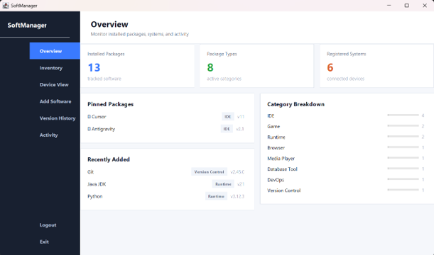
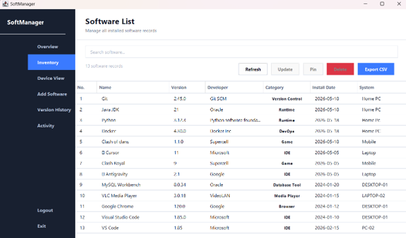
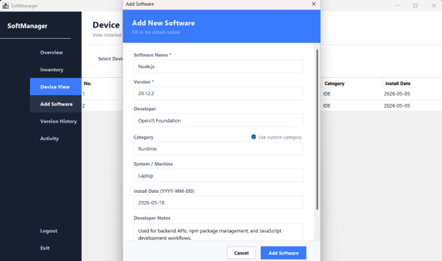
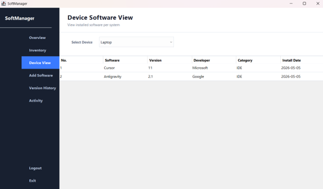
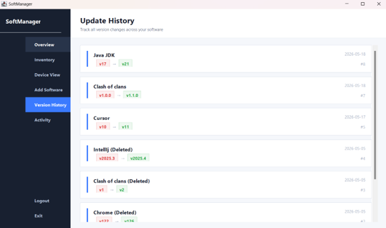
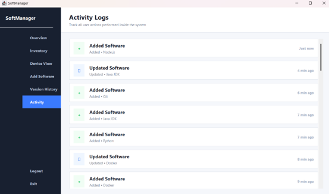
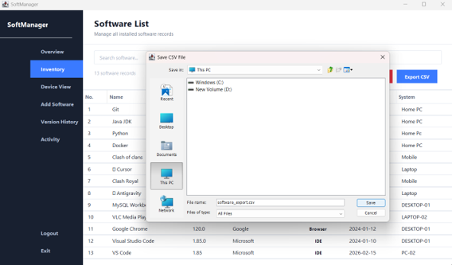

# SoftManager

A desktop-based **Software Inventory Management System** developed using **Java Swing**, **JDBC**, and **MySQL**. The application enables users to manage software installations across multiple systems through a modern interface with inventory management, version tracking, and activity monitoring.

---

## Features

- 🔐 User Authentication (Login & Registration)
- 📦 Software Inventory Management
- ➕ Add, Update and Delete Software
- 🔍 Real-time Search
- 💻 Device-wise Software View
- 📌 Pin Important Software
- 📝 Developer Notes
- 📋 Software Details Dialog
- 🕒 Version History Tracking
- 📊 Activity Logs
- 📈 Dashboard Analytics
- 📤 Export Inventory to CSV

---

## Tech Stack

- Java
- Java Swing
- JDBC
- MySQL
- IntelliJ IDEA / VS Code

---

## Project Structure

```
src/
├── Authentication
├── Dashboard
├── Inventory
├── Device View
├── Version History
├── Activity Logs
├── Database
└── Theme
```

---

## Dashboard

Displays a quick overview of the inventory including:

- Total Installed Packages
- Package Types
- Registered Systems
- Pinned Packages
- Recently Added Software
- Category Breakdown



---

## Inventory

Manage software records with:

- Search
- Update
- Delete
- Pin Software
- Double-click Details
- Export CSV



---

## Add Software

Add new software records with details including:

- Software Name
- Version
- Developer
- Category
- System
- Install Date
- Developer Notes



---

## Device View

Filter and view software installed on individual systems using a device selector.



---

## Version History

Automatically stores previous software information whenever an update is performed.



---

## Activity Logs

Tracks important user activities including:

- Login
- Logout
- Software Added
- Software Updated
- Software Deleted



---

## Export CSV

Export the complete software inventory for reporting or backup.



---

## Database

The project uses MySQL with the following primary tables:

- `users`
- `software`
- `activity_logs`
- `update_history`

---

## How to Run

1. Clone the repository

```bash
git clone https://github.com/raahu1l/Software-installation-manager.git
```

2. Import the project into your Java IDE.

3. Create the MySQL database.

4. Import:

```
finalManager.sql
```

5. Update database credentials in the connection class if required.

6. Run the application.

---

## Future Improvements

- PDF Export
- Automatic Software Detection
- Multi-user Roles
- Backup & Restore
- Dark Theme

---

## Author

**Rahul Walawalkar**

If you found this project useful, consider giving it a ⭐.
